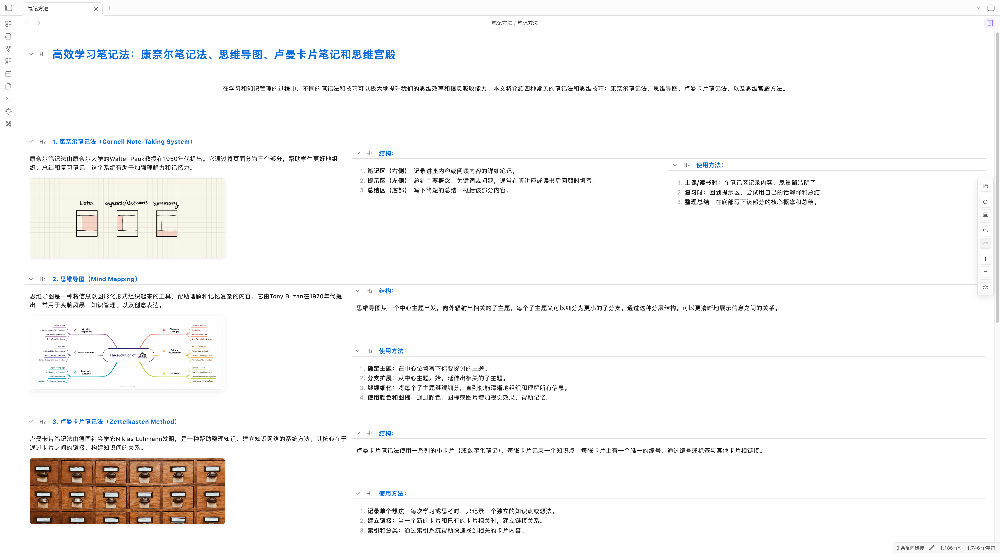
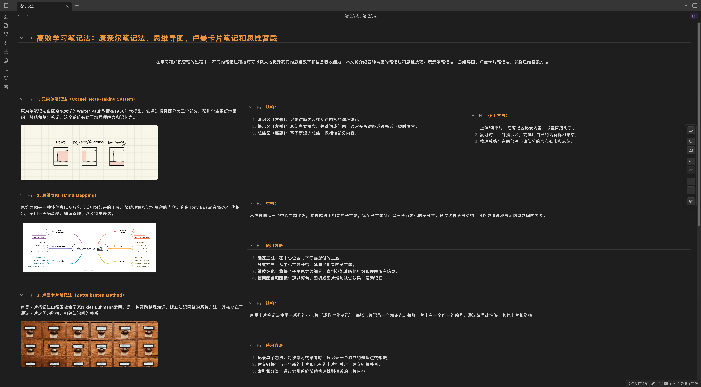

# GridNote – Structured Knowledge at Card-Level Focus

> **Obsidian’s Cornell-style tree view that keeps your Markdown in sync while you read, learn, and edit in focused cards.**

> ⚠️ **Important Disclosures**
> - **Closed source:** The public release is compiled code only.
> - **Free vs Pro:** Tree reading, copying, and search are free. Inline/dual editing, tier controls, quick switching, and screenshot export require a paid GridNote Pro license.
> - **Network:** Only Pro activation/verification uses the internet. Your notes never leave your vault.

## 🌳 What Makes GridNote Different?

- **Cornell-inspired tree cards** – Every heading becomes a cue column + content card so you can skim the outline and dive into details without leaving context.
- **Always-synced editing** – GridNote sits on top of the native Markdown view, keeps folds, and automatically inserts a missing H1 so documents stay well-formed.
- **Productivity toolbar** – Floating controls for search, undo/redo, keyboard cheatsheet, plus Pro-only depth and quick file switching from anywhere in the document.
- **Share-ready output** – Copy plain or rich text per card, or open the screenshot composer to export depth-limited cards as polished images.

---

## 🧭 Feature Tour

### Tree-Structured Cornell Cards
- Converts headings (H1–H6) into hierarchical “cue + detail” lanes so long documents stay scannable.
- Collapsible columns remember their fold state per file via `FoldStateManager`, even after you reorder headings.
- Internal Obsidian links remain clickable; GridNote routes them back to the editor when needed.

### Editing & Dual View
- Click a selected card to edit: Pro users edit inline with syntax-highlighted CodeMirror, while free users open the synced right-hand editor via `FallbackEditorManager`.
- Double-click headers (or press `T`) to rename without leaving the tree. GridNote rewrites the underlying Markdown line and saves automatically.
- Quick-add buttons (or `Ctrl/Cmd+Shift+↑/↓/→`) insert siblings/children with correct heading depth and spacing.
- Modal editing leverages the embeddable editor for focused changes when you do not want to leave the tree.

### Search, Navigation & Shortcuts
- Floating search (`Ctrl/Cmd+F` or `Ctrl/Cmd+K`) highlights every match across cards, keeps a live counter, and jumps with ↑/↓ or Enter/Shift+Enter.
- Keyboard navigation mirrors a mind map: arrow keys walk between parents, siblings, or children, and `F` selects the first visible card.
- Press `K` to open the in-app shortcuts overlay. Undo/redo buttons stay in sync with the underlying editor history and auto-scroll to the last changed node.

### Copy & Share
- Copy the whole document, the current card, or its entire subtree as plain Markdown.
- Need styling? Copy rendered HTML/Rich Text, perfect for pasting into mail, slides, or wikis.
- Each header menu also exposes “Share as image,” which launches the screenshot composer described below.

### Screenshot Composer (Pro)
- Capture any heading (and optional descendants) as a responsive Cornell layout image.
- Adjust visible depth (1–5), font size, width, and selectively hide/show children before exporting.
- Save directly to your vault (default folder: `GridNote-Screenshots`), copy to clipboard, or download locally via the bundled Snapdom renderer.

### Mobile & Scale-Aware Layout
- Automatic device detection keeps the layout readable on tablets or sidecar setups by scaling to 70–95% without breaking hit targets.
- Floating toolbar respects safe areas, and every component forces `pointer-events: auto` so scaled views remain interactive.

### Reliability & Performance
- `md2tree` plus incremental caching handles 10,000+ line files while diffing only the changed ranges.
- Fold states are recomputed by header text, so your collapsed outline survives reorganizing or undo/redo storms.
- A background `ViewToggleManager` keeps GridNote embedded in the native Markdown view, so you do not pay the cost of opening a second pane.

---

## 💎 Free vs. GridNote Pro

| Capability | Free | Pro |
| --- | :---: | :---: |
| Cornell tree reading & folding | ✅ | ✅ |
| Full-text search, highlights, keyboard overlay | ✅ | ✅ |
| Copy plain or rendered text | ✅ | ✅ |
| Inline editing from cards | ❌ | ✅ |
| Smart dual-view (tree + right editor kept in sync) | ⚠️ opens fallback editor | ✅ stays inline/linked |
| Depth/tier controls & quick file switch | ❌ | ✅ |
| Insert siblings/children via toolbar shortcuts | ✅ | ✅ |
| Screenshot composer export (clipboard/vault/local) | preview only | ✅ |
| Priority fixes + early feature access | ❌ | ✅ |

`⚠️` Free users still edit safely: clicking a selected node opens the synced Markdown view on the right so nothing is locked away.

---

## 🚀 Getting Started

### Installation
1. Install → Enable.
2. Use the tree icon in the left ribbon (or the status bar toggle) to switch the active Markdown file into GridNote mode.

### Basic Workflow
1. Structure your document with headings (H1–H6). GridNote auto-inserts a safe H1 if one is missing, without touching existing frontmatter.
2. Click any header in the cue column to focus its card; tap again to edit (Pro) or to pop the linked editor (Free).
3. Use the floating toolbar to search, undo/redo, or show shortcuts. Keep heading depth manageable by collapsing or by lowering the tier (Pro).
4. Copy or share from the header menu, or press `Ctrl/Cmd+Shift+→` to add children on the fly.

### Activating GridNote Pro
1. Purchase a license at [gridnote.cn](https://gridnote.cn/#/landing). One order unlocks up to **3 devices**.
2. In **Settings → GridNote**, copy your device ID (auto-generated) and enter the order number.
3. GridNote encrypts the activation in localStorage, re-validates every 7 days, and syncs the status to `data.json`. Mobile builds honor the stored flag even if localStorage is unavailable.
4. Need to force a check? Use **Refresh verification** inside the settings tab.

---

## ⚙️ Settings & Customization

- **Screenshot folder:** Pick the vault-relative folder used by the composer (default `GridNote-Screenshots`).
- **Toolbar depth controls (Pro):** Fine-tune the number of visible tiers or lock the view to only top-level sections when presenting.
- **Quick file switch (Pro):** Launch Obsidian’s command palette filtered to Markdown files directly from the toolbar.
- **Keyboard overlay:** Tap the keyboard icon or press `K` to see all navigation, editing, and insertion shortcuts in one place.
- **Modal editor:** From any header menu choose “Edit in modal” to open an embeddable CodeMirror focused on just that subtree.

---

## 🔒 Privacy & Network Usage

- **No telemetry:** GridNote never sends usage analytics, headings, or vault content anywhere.
- **All parsing is local:** `md2tree`, folding, search, screenshots, and image previews run entirely inside Obsidian.

---

## 🧰 Technical Details

- **Version:** 1.1.16  
- **Platform:** Desktop Obsidian (flagged `isDesktopOnly: true`). Tablet scaling is optimized for Sidecar/Stage Manager, with native mobile support under active development.  
- **Minimum Obsidian:** 0.15.0+  
- **Files:** Standard `.md` stored in your vault.  
- **Performance tooling:** Tree cache, virtualized rendering, viewport-aware highlights, and undo-aware re-rendering keep large projects smooth.  
- **Image preview:** Clicking an image while in preview opens Obsidian’s native modal via the bundled `imagePreview` action.

---

## 💬 Support & Feedback

- **Issues:** [GitHub Issues](https://github.com/Dcx199302/Obsidian-GridNote-Plugin/issues)  
- **Ideas & discussions:** [GitHub Discussions](https://github.com/Dcx199302/Obsidian-GridNote-Plugin/discussions)  
- **Product updates & purchasing:** [gridnote.cn](https://gridnote.cn/#/landing)

---

## 📄 License

GridNote is distributed as closed-source software. The reading experience is free; a Pro license is required to unlock inline/dual editing, depth controls, screenshot exports, and premium support.

---

**Transform how you study, write, and think — one focused card at a time.**

**[Install GridNote Today](obsidian://show-plugin?id=grid-note)**

---

*Made with ❤️ by [ChengDong Xu](https://github.com/Dcx199302)*

